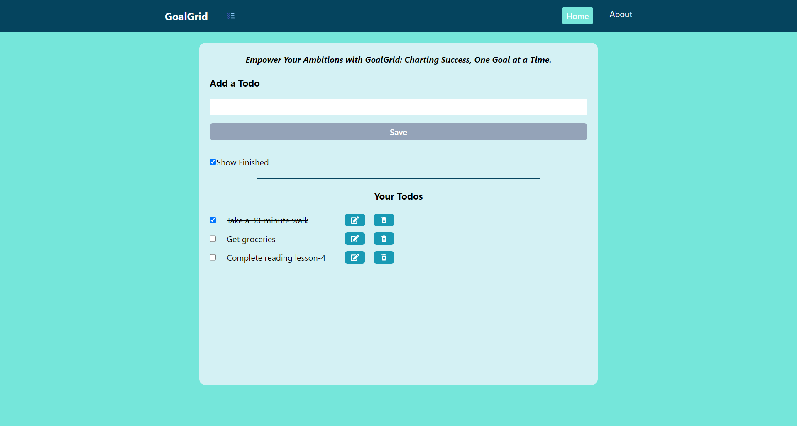

# GoalGrid

GoalGrid is a web application built using Vite, React, React Router DOM v6, Tailwind CSS, and React Icons. It provides a user-friendly platform for organizing and tracking your goals, with a responsive design for seamless access across devices.

## Features

- **Effortless Goal Setting:** Add and articulate your goals seamlessly.
- **Dynamic Progress Tracking:** Witness your progress with an interactive grid.
- **Intuitive Goal Filtering:** Tailor Goal Grid to your unique approach with powerful filtering options.
- **Achievement Celebration:** Celebrate victories by marking goals as complete.
- **Responsive Design:** Access Goal Grid seamlessly on desktops, tablets, and smartphones.

## Demo

Check out the [Demo](https://goalgrid-todolist.netlify.app/) to experience GoalGrid in action.

## Installation

1. Clone the repository: `git clone https://github.com/sri-anya/todoList.git`
2. Install dependencies: `npm install`

## Usage

Run the development server:

```bash
npm run dev
```
Visit http://localhost:3000 in your browser.

## Technologies Used
- Vite
- React
- React Router DOM v6
- Tailwind CSS
- React Icons

## Badges
[](https://vitejs.dev/)
[](https://reactjs.org/)
[](https://reactrouter.com/)
[](https://tailwindcss.com/)
[](https://react-icons.github.io/react-icons/)


Contact
For any inquiries, please contact [aasthasaxena100@gmail.com].